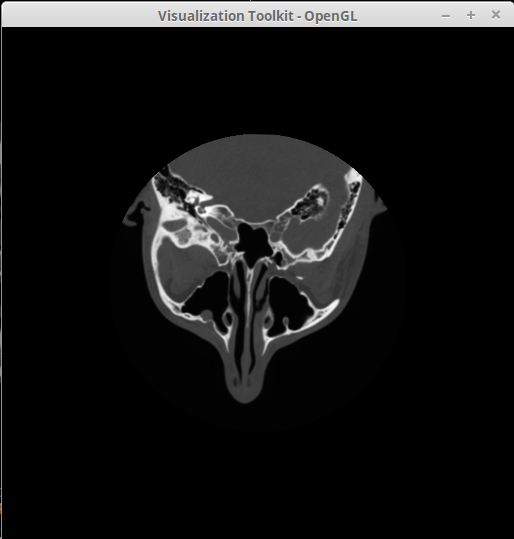
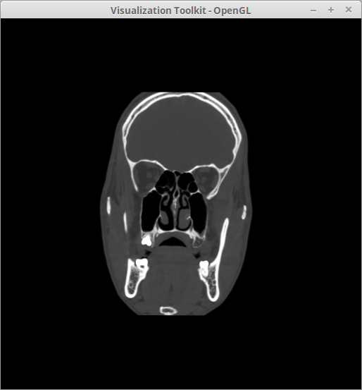
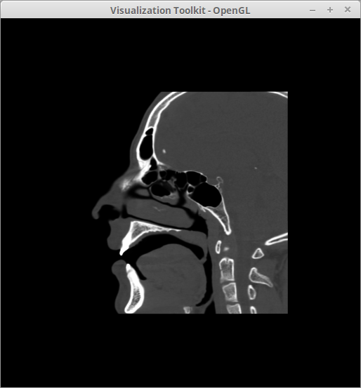
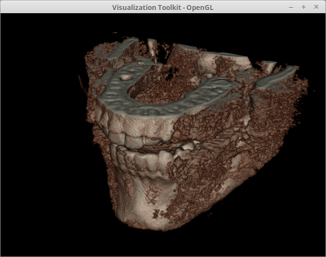
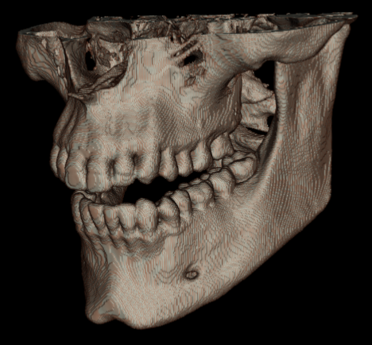
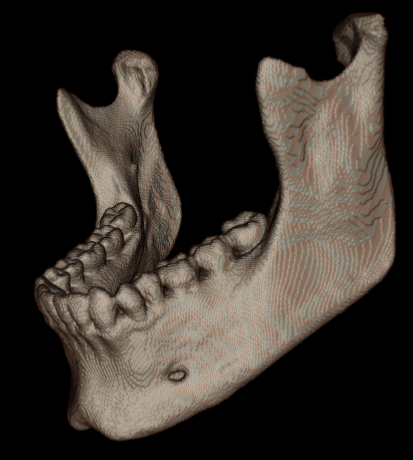
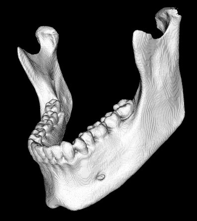
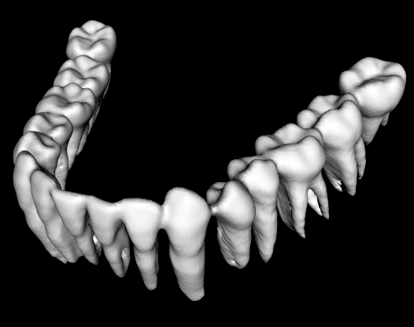
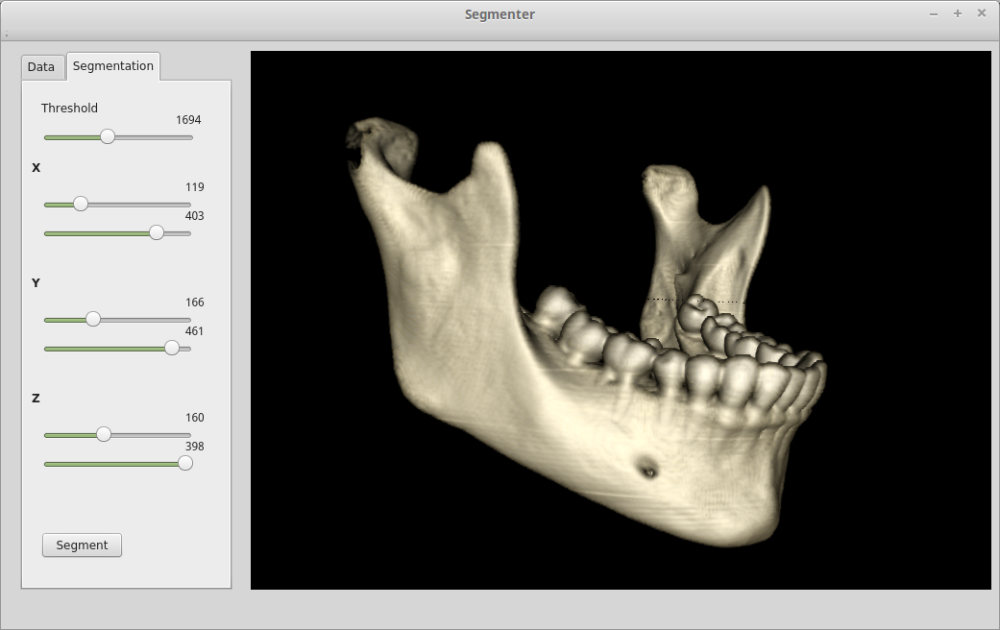
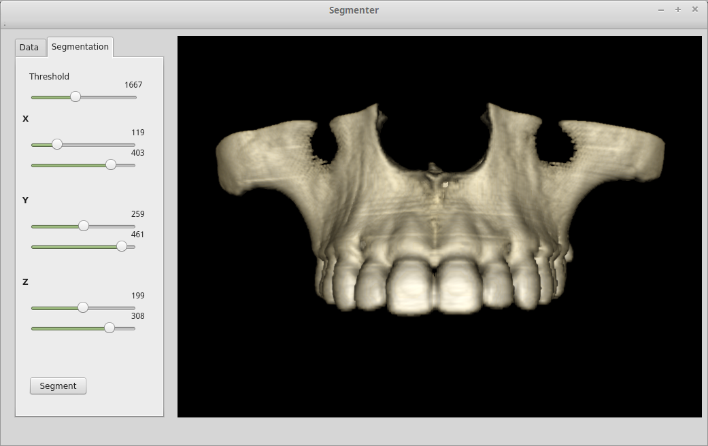

# 3D Mandible Segmentation 
An Optimized Technique of 3D Segmentation for Orthodontic Treatment Plan. 
# Build 

Dependencies:

* VTK 7.1
* Qt5
* OpenMP

```bash
$ cd mandible-segmentation
$ mkdir build 
$ cd build
$ cmake .. 
$ make -j 4
```

The executable files will be under the following directory.

```bash
mandible-segmentation/bin
```

## Loading DICOM Series





## Extracting ROI and Volume Thresholding





## 3D Breadth First Search (BFS) for mandible segmentation





## Teeth Segmentation



## UI Tool 



